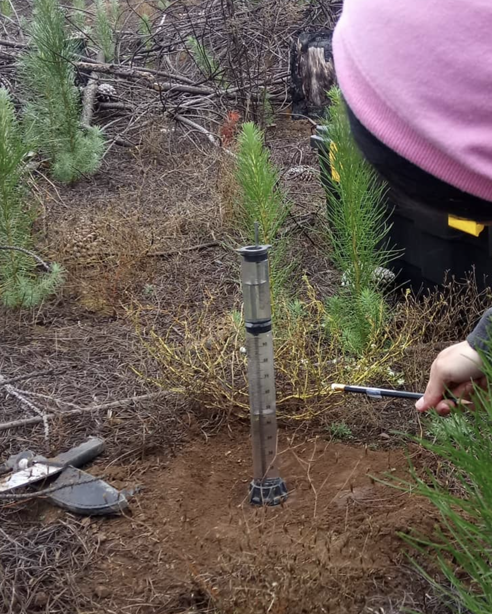
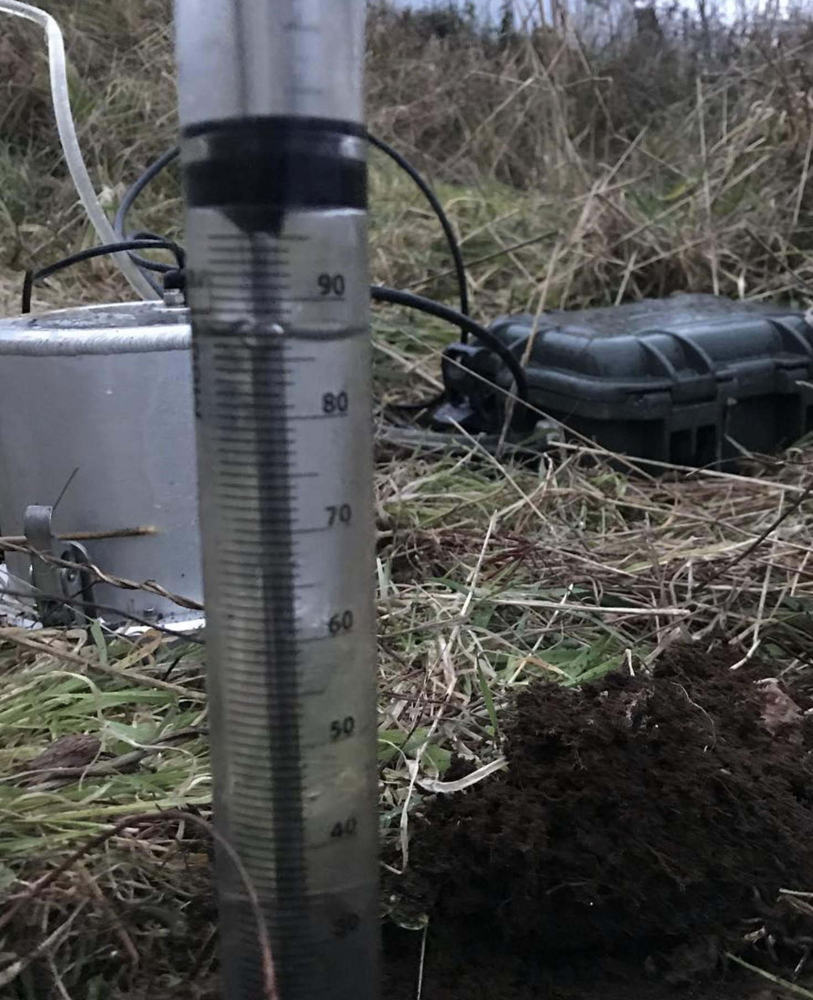
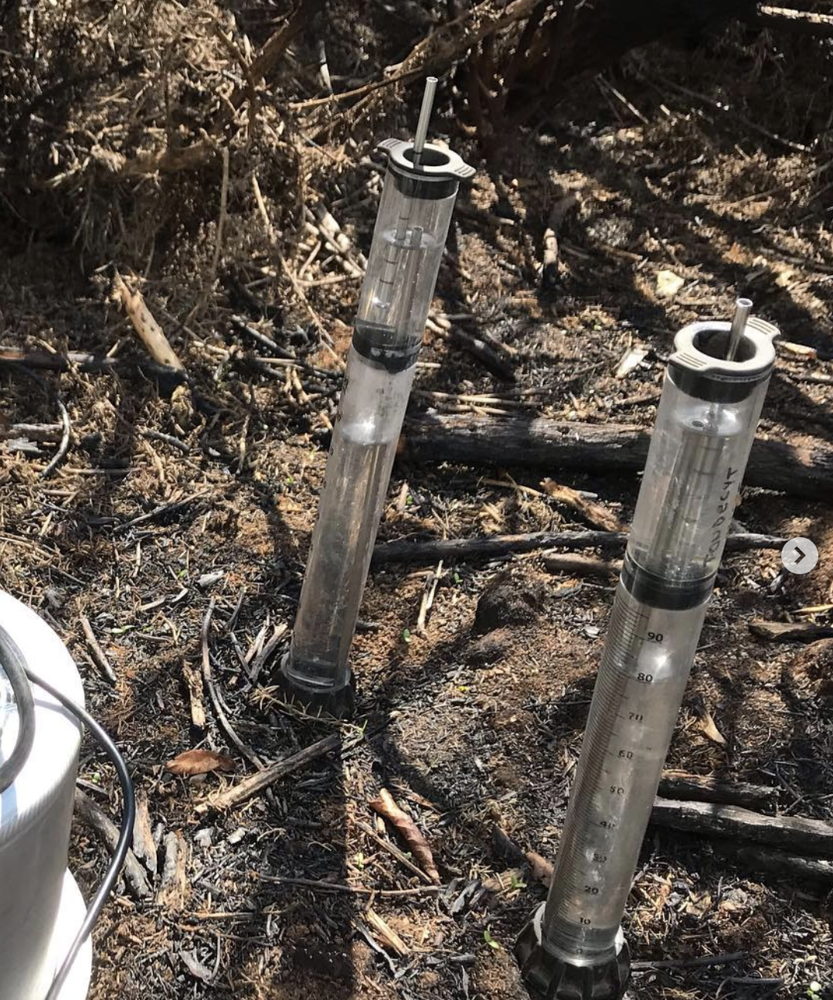

# infiltrodiscR

<!-- badges: start -->
<!-- badges: end -->

The goal of infiltrodiscR is to provide functions for the modeling of data derived from the Minidisc Infiltrometer device

## Instalation

You can install the development version of infiltrodiscR from [GitHub](https://github.com/Saryace/infiltrodiscR) with:

``` r
# install.packages("devtools")
devtools::install_github("Saryace/infiltrodiscR")
```

## Main functions:

**`infiltration()`**

This function calculates cumulative infiltration and the square root of time, using time and volume recorded. 

**`vg_par`**

This function returns the parameter *A*, *no_h* and *alpha* related to the van Genuchten parameters (van Genuchten, 1980), from tabulated data calculated for a radius of 2.25 cm, including 12 soil texture classes and suctions from -0.5 cm to -7 cm. Data from (Decagon Devices, Inc., 2005)

**`parameter_A`**

This function returns the parameter *A* calculated from the equation proposed by Zhang (1997)

## Introduction



While it is simple and easy to use, the data from Minidisc Infiltrometer must be processed in a reproducible manner. A common way is to use an [Excel macro](https://library.metergroup.com/Sales%20and%20Support/METER%20Environment/New-Minidisk-Infiltrometer-Macro.xlsx) provided by the supplier on their website, but for handling a large number of samples this can be complex. Minidisc infiltrometers have been [used](https://www.metergroup.com/en/meter-environment/products/mini-disk-infiltrometer-usaturated-hydraulic-conductivity) to understand infiltration in soils, hydrophobicity, irrigation system design, erosion and burn severity.   



## Tutorial

### Step 1.
To determine the unsaturated hydraulic conductivity at specific suctions, the Minidisc Infiltrometer data can be fitted to the method proposed by Zhang (1997). The first step is to calculate the cumulative infiltration vs. the square root of time.


``` r
library(tidyverse)
library(infiltrodiscR)
infiltration_data <- tibble(
  soil = c(rep("soil_a",11), rep("soil_b",11)),
  time = c(0, 30, 60, 90, 120, 150, 180, 210, 240, 270, 300,
           0, 35, 65, 95, 125, 155, 185, 215, 245, 275, 305),
  volume = c(95, 89, 86, 83, 80, 77, 74, 73, 71, 69, 67,
             83, 77, 64, 61, 58, 45, 42, 35, 29, 17, 15)
)

infilt_cum_sqrt <-
infiltration_data %>% 
group_by(soil) %>% 
nest() %>% 
mutate(data = map(data, ~ infiltration(.), data = .x)) %>% 
unnest(cols = data)

infilt_cum_sqrt 
```

### Step 2.
Now thee Van Genuchten parameters n, alpha and A are extracted from the Minidisk Infiltrometer Table (Decagon Devices, Inc., 2005). The radius (2.25 cm) corresponds to the Minidisk Infiltrometer specs. 

``` r
parameters <- vg_par(texture = c("clay", "sand"),
                     suction = c("2cm", "3cm"))

infilt_cum_sqrt_par <-
infiltration_data %>% 
group_by(soil) %>% 
nest() %>% 
mutate(data = map(data, ~ infiltration(.), data = .x)) %>% 
bind_cols(parameters)

infilt_cum_sqrt_par
```
### Step 3.
The hydraulic conductivity of the soil K at a specific suctions is calculated as: K(h) = C1 / A. Parameter C1 is calculated fitting a polynomial function of the second degree (y = ax2+b), where a is parameter C1, x is the square root of time and y is the cumulative infiltration. For this step, we use the package broom and base R. 

``` r
library(broom)
infilt_cum_sqrt_par_fit <-
infilt_cum_sqrt_par %>% 
  mutate(
    fit = map(data, ~ lm(infiltration ~ poly(sqrt_time, 2, raw = TRUE), data = .x)),
    tidied = map(fit, tidy)
  ) %>% 
  unnest(tidied) %>% 
filter(term == "poly(sqrt_time, 2, raw = TRUE)2")
  
infilt_cum_sqrt_par_fit
```
The column `estimate` corresponds to the parameter C1

``` r
infilt_cum_sqrt_par_fit <-
infilt_cum_sqrt_par_fit %>% 
rename(C1 = estimate)
```

### Step 4.
The hydraulic conductivity of the soil K at a specific suctions is calculated as: K(h) = C1 / A. Parameter C1 is already calculated, and parameter A is calculated using the function. 

``` r
parameter_A(infilt_cum_sqrt_par_fit) %>% 
 mutate(K_h = C1 / parameter_A)
```

You can check that the values of A from the equation and the table are equivalent. 


